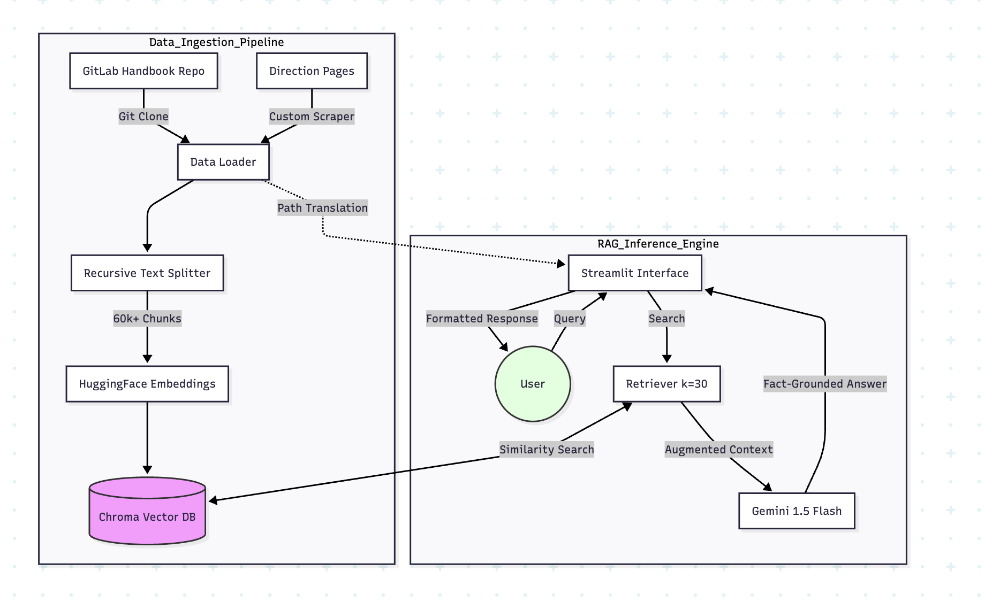

# GitLab Assistant 

A conversational AI assistant designed to answer questions based on the GitLab Handbook and Direction pages. This project utilizes Retrieval-Augmented Generation (RAG) to provide accurate, context-aware responses backed by live source URLs.

## System Architecture



## Prerequisites

- **Python 3.9+**
- **Git** (Required to clone the GitLab Handbook locally)
- A **Google Gemini API Key** (Free tier works perfectly)

## Setup Instructions

1. **Clone the repository** (if you haven't already):
   ```bash
   git clone <your-repo-url>
   cd gitlab_chatbot
   ```

2. **Create a virtual environment** and activate it:
   ```bash
   python -m venv venv
   source venv/bin/activate
   ```

3. **Install dependencies**:
   ```bash
   pip install -r requirements.txt
   ```

4. **Set up your environment variables**:
   Create a `.env` file in the root directory and add your Google Gemini API key:
   ```env
   GEMINI_API_KEY=your_gemini_api_key_here
   ```

## How to Run

1. **Build the Vector Database**:
   ```bash
   python build_vector_store.py
   ```

2. **Start the Streamlit App**:
   ```bash
   streamlit run app.py
   ```
